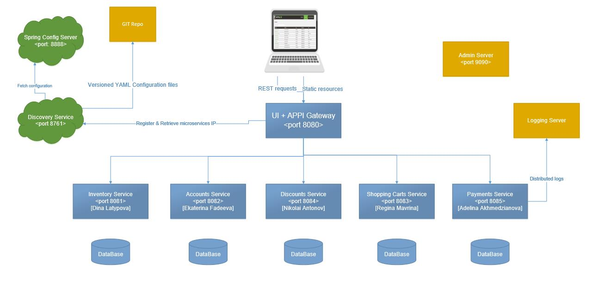

# ONLINE STORE

## Architecture overview
* Blue microservices show the app's functionality via the REST API. To ensure horizontal scalability and fault tolerance, multiple instances of the same microservice can be started simultaneously. To be Autonomous, each microservice has its own database. However, all instances of the same microservice share the same database (which can be clustered). The JavaScript interface does not directly attack these 3 microservices: it passes through the front-end gateway API microservice, which also serves static resources (JavaScript code, HTML pages, and CSS).
* In green, we find the microservice infrastructure: Eureka services will allow microservices to register and then communicate without knowing their IP addresses in advance.

Each of the microservices is an app in the sense of Spring loading. Each of them has its own Maven module containing some Java classes and configuration files.

## List of services
* User service - the user service is responsible for being the authentication gateway for the online store application. 
* Account service - storing the account information of a user.
* Inventory service - the inventory and product catalogs in the online store.
* Shopping Cart Service - managing the products that a user has chosen to add to their online shopping cart.
* Discount Service - store information abiut discounts.
* Payment Service - information about payment methods.

1. The main microservices used:  
API-Gateway 
2. Auxiliary microservices:  
Account, Inventory, Discount, Shopping-cart, Payment

## Starting
Every microservice is a Spring Boot application and can be started locally using IDE or ../mvnw spring-boot:run command. Supporting services (Config and Discovery Server) must be started before any other application. 
If everything goes well, you can access the following services at given location:

Config Server - http://localhost:8888
Discovery Server - http://localhost:8761
AngularJS frontend (API Gateway) - http://localhost:8080

In order to start entire infrastructure using Docker, you have to build images by executing ./mvnw clean install -P buildDocker from a project root. Once images are ready, you can start them with a single command docker-compose up. Containers startup order is coordinated with dockerize script. After starting services it takes a while for API Gateway to be in sync with service registry, so don't be scared of initial Spring Cloud Gateway timeouts. You can track services availability using Eureka dashboard available by default at http://localhost:8761.
*  API Gateway
*  Inventory
*  Account
*  Shopping-Cart
*  Payment
*  Discount

## Team: 
* Akhmedzianova Adelina
* Antonov Nikolai
* Fadeeva Ekaterina
* Latypova Dina
* Mavrina Regina
:)
